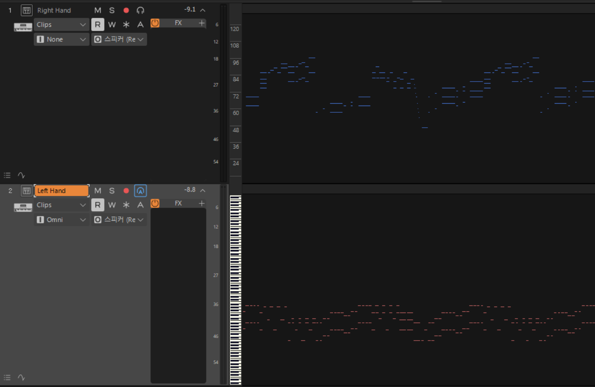

# Video2Score


$$ \Downarrow\Downarrow\Downarrow\Downarrow\Downarrow\Downarrow\Downarrow\Downarrow\Downarrow\Downarrow\Downarrow\Downarrow\Downarrow\Downarrow\Downarrow\Downarrow\Downarrow\Downarrow\Downarrow $$



A tool to convert Synthesia videos into MIDI files by detecting key presses based on color profiles (**NOT AUDIO TO MIDI**).\
Currently supports _**88-key layouts**_ only.

## Prerequisites

- Python 3.x (tested on 3.14.6)
- OpenCV
- NumPy
- Mido
- PyQt5

Install dependencies:
```bash
pip install opencv-python numpy mido PyQt5
```

## How to Run

1. Place your video file in the project folder.
2. Open `run.py` to configure the following settings:
   - `VIDEO`: Set the file path to your target video (e.g., `"V.mp4"`).
   - `BPM`: Adjust the tempo in the `create_midi.generate_midi()` function to match your video's performance speed.
   - `TIME_SIGNATURE`: Adjust the Time Signature in the `create_midi.generate_midi()` function to match your video's meter (e.g., 4/4 $\rightarrow$ (4,4)).
3. Run the main pipeline:
```bash
python run.py
```

## Workflow

The program follows a 3-step process:

### 1. Calibration
The GUI wizard will launch to:
- **Select Keyboard Region:** Drag a box around the keyboard area in the video.
- **Adjust Keys:** Fine-tune individual key detection rectangles.
- **Sample Colors:** Click the corresponding key detectors while the keys are pressed (left/right hand, white/black keys) to define the color profiles.

### 2. Detection (`frame_check.py`)
Analyzes the video frame-by-frame using the defined color profiles to detect note-on/note-off events.
- It generates `note_events.json` containing timing and MIDI information.

### 3. MIDI Generation (`create_midi.py`)
Converts the JSON events into a MIDI file.
- **BPM/Tempo:** You can adjust the `bpm` parameter in `run.py` to match the performance tempo.
- Output file: `output.mid`

## TO-DO / Future Improvements

- [ ] Support for various keyboard sizes beyond the standard 88-key layout
- [ ] Add option to customize the starting/lowest note of the keyboard layout