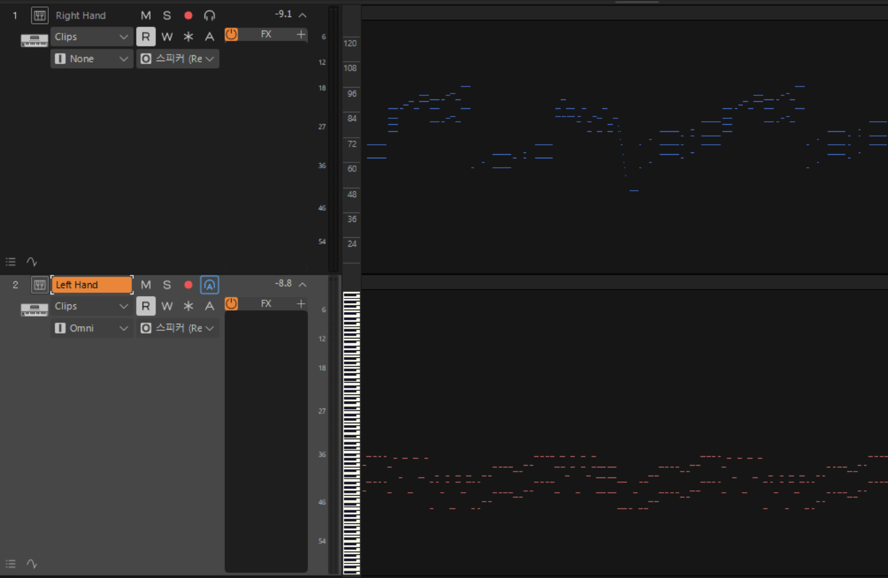

# Video2Score

before


after



A tool to convert Synthesia piano videos into MIDI files by detecting key presses based on HSV color profiles (**NOT AUDIO TO MIDI**).\
Currently supports standard **88-key layouts**.


## Prerequisites

- Python 3.x (tested on 3.10+)
- OpenCV
- NumPy
- Music21
- PyQt5

Install dependencies:
```bash
pip install opencv-python numpy music21 PyQt5
```


## How to Run

The conversion pipeline consists of setting configurations, calibrating key regions and colors, detecting note events, and generating the MIDI score with frame-to-beat quantization.

---

### Step 1. Configure Settings in `run.py`
Place your source video in the `source/` folder (e.g., `./source/your_video.mp4`).

> [!TIP]
> **Video Resolution & Performance:**
> Avoid using ultra-high-resolution videos like **4K**, as frame decoding and processing will be extremely slow. Moderate resolutions such as **720p at 60 fps** work completely fine, detect keys accurately, and process substantially faster!

Open `run.py` and adjust the configuration parameters:
- `VIDEO`: Path to your target video file.
- `BPM`: Performance tempo (beats per minute) of the song.
- `TIME_SIGNATURE`: Meter of the piece (e.g., `'4/4'`, `'3/4'`).
- `MISS_GRID`: Minimum quantization unit dividing 1 beat into equal parts (e.g., `Fraction(1, 16)` divides 1 beat into 16 subdivisions).
- `REST_IGNORE_FRAMES`: Gaps shorter than or equal to this threshold are ignored, preventing accidental tiny rests.
- `ONSET_MERGE_TOLERANCE`: Merges note attacks within this frame window into a simultaneous chord.

---

### Step 2. Calibrate Keyboard and Colors (`calibration.py`)
Uncomment `calibration.run_calibration_wizard(...)` in `run.py` and run:
```bash
python run.py
```
A PyQt5 GUI wizard will open:
1. **Select Keyboard Region (1/3):** Use the frame slider to find a clear view of the keyboard, then drag a bounding box enclosing the entire 88-key keyboard area.
2. **Adjust Key Boxes (2/3):** Fine-tune detection box positions and sizes using arrow keys, `+`/`-` (width), and `[`/`]` (height).
3. **Sample Colors (3/3):** Click the corresponding key detector boxes when keys are pressed to define the active color profiles.
   - **Multi-Voice Support:** Default voices are **Left Hand** (Bass Clef) and **Right Hand** (Treble Clef). You can add additional voices (e.g., Tenor, Vocal, Pedal) anytime by pressing **`V`** or clicking the **`[+ Add Voice]`** button. Added voices will be sampled in sequence and exported to their own named tracks in the MIDI file.

---

### Step 3. Detect Note Events (`frame_check.py`)
Comment out calibration and uncomment `frame_check.process_video(...)` in `run.py`:
```bash
python run.py
```
This analyzes the video frame by frame, matches key colors against your calibrated profiles, and saves detected note onsets and durations to `data/note_events.json`.

---

### Step 4. Frame Analysis & MIDI Generation (The Core Step)
Synthesia videos render notes visually across frames. Accurately converting frame durations into musical note values is the core of this pipeline.

#### A. Initial Frame Duration Measurement with `analyze.py`
Before generating MIDI, measure how many frames notes are held for each musical duration:
1. Open `analyze.py`, set `VIDEO` to your video path, and run:
   ```bash
   python analyze.py
   ```
   **Controls:**
   - `Q` / `W`: Step 1 frame backward / forward
   - `A` / `S`: Step 50 frames backward / forward
   - `Z` / `X`: Step 200 frames backward / forward
   - `F`: Toggle Fullscreen | `ESC`: Exit
2. Find typical notes (e.g., quarter note, eighth note, half note) and count how many frames they stay pressed.
3. In `create_midi.py`, register these frame-to-beat values in `DURATION_MAP`:
   ```python
   DURATION_MAP = {
       # frames: quarterLength (1.0 = quarter note, 0.5 = eighth note, etc.)
       10: 0.5,
       20: 1.0,
       40: 2.0,
   }
   ```

#### B. Generate MIDI and Resolve Unmatched Frames Using the Log
Uncomment `create_midi.generate_midi(...)` in `run.py` and run:
```bash
python run.py
```
If a note's duration does not have an exact match in `DURATION_MAP`, it interpolates between known values and outputs a **Quantize Miss Log**:
```text
========== RESULT ==========
MIDI : ./output/output.mid

Right Hand Quantize Miss : 2
   15 frames : 3 times
       raw=0.750 beat -> 0.750  error=+0.0000   (10~20 frame interpolation)   at frame 142
   33 frames : 1 times
       raw=1.650 beat -> 1.750  error=+0.1000   (20~40 frame interpolation)   at frame 380
```
- **How to resolve misses:**
  1. Inspect the log for the unmapped frame count (`15 frames`) and the timestamp where it happened (`at frame 142`).
  2. Open `analyze.py`, jump to frame `142`, and verify what musical note value it represents (e.g., dotted eighth note = `0.75`, triplet, etc.).
  3. Add the exact entry to `DURATION_MAP` in `create_midi.py` (e.g., `15: 0.75`).
  4. Run `create_midi` again. Repeat until misses are minimized and the rhythm is accurate.
  5. The final score is saved to `output/output.mid` with all designated voice tracks and aligned debug tracks.


## Workflow

The complete processing workflow consists of 3 distinct stages:

### 1. Calibration (`calibration.py`)
- Interactive GUI wizard using PyQt5.
- **Select Keyboard Region:** Drag an enclosure around the 88-key keyboard.
- **Adjust Keys:** Position and size detection boxes per key.
- **Sample Colors:** Sample HSV colors on pressed keys for both white and black keys across all voices. Supports dynamic voice creation via `V` / `[+ Add Voice]`.

### 2. Detection (`frame_check.py`)
- Scans video frames against calibrated HSV color profiles.
- Handles multi-voice note-on and note-off events independently.
- Outputs structured note events and voice metadata to `data/note_events.json`.

### 3. MIDI Generation (`create_midi.py`)
- Maps frame durations to exact musical beat lengths using `DURATION_MAP`.
- Merges chord clusters and handles rests based on tolerance thresholds.
- Assigns designated voice names (`voice["name"]`) and clefs (Treble / Bass) to independent MIDI tracks.
- Produces aligned debug tracks alongside melody tracks to inspect quantization timing in your DAW or score viewer.


## Experimental Parameters

You can fine-tune these parameters in `run.py` to adapt to different playing styles and video frame rates:

- `MISS_GRID`: Smallest quantization beat division (e.g., `Fraction(1, 16)` splits 1 beat into 16 subdivisions as the minimum grid unit).
- `REST_IGNORE_FRAMES`: Frame gaps shorter than or equal to this threshold are merged as unbroken notes.
- `ONSET_MERGE_TOLERANCE`: Window in frames to bundle close note onsets into simultaneous chords.


## TO-DO / Future Improvements

- [ ] Support for various keyboard sizes beyond the standard 88-key layout
- [ ] Add option to customize the starting/lowest note of the keyboard layout
- [ ] Automatic tempo and frame-duration detection
